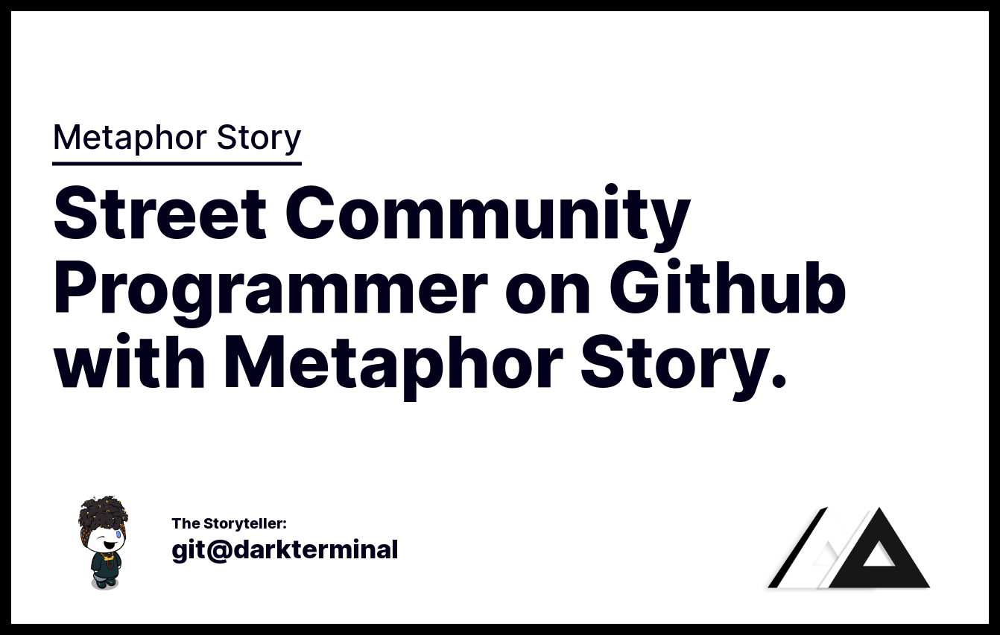
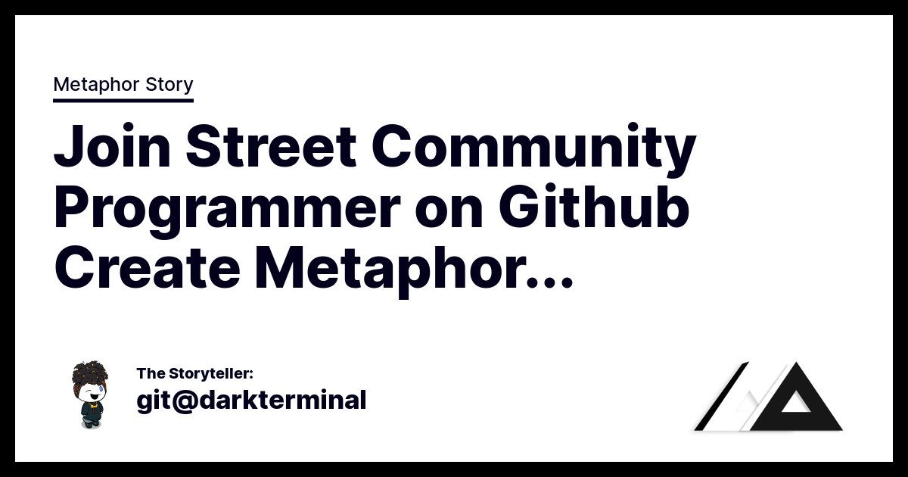
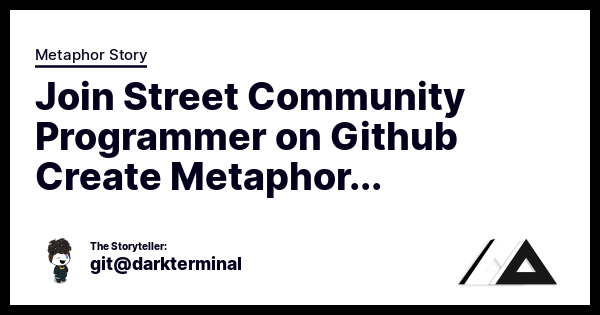
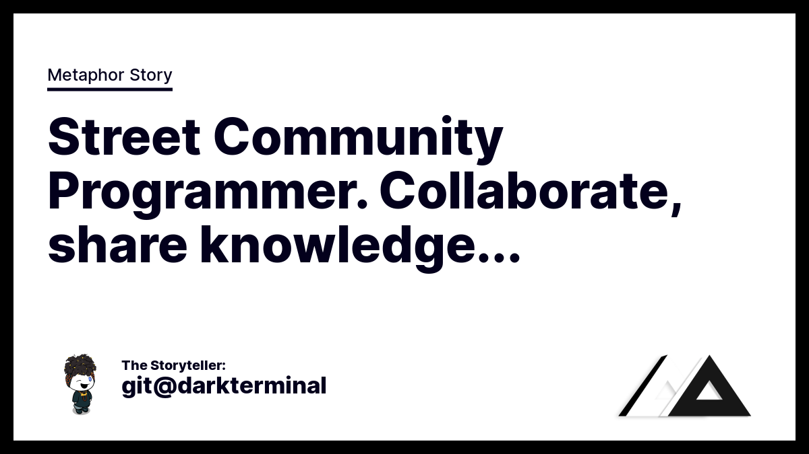
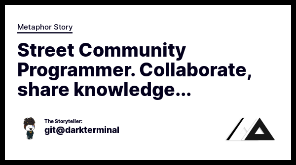
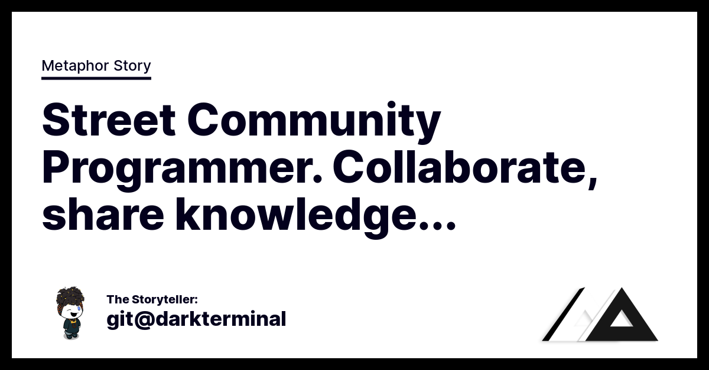
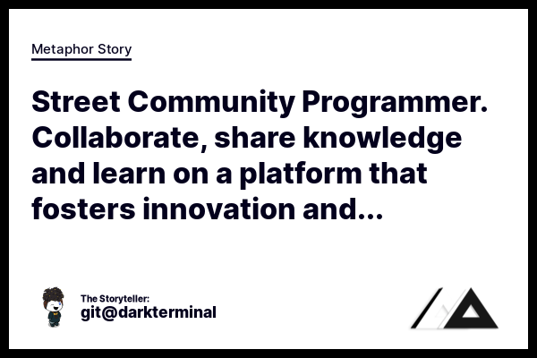
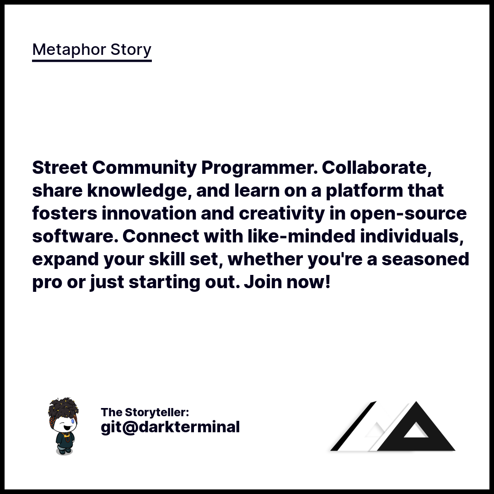
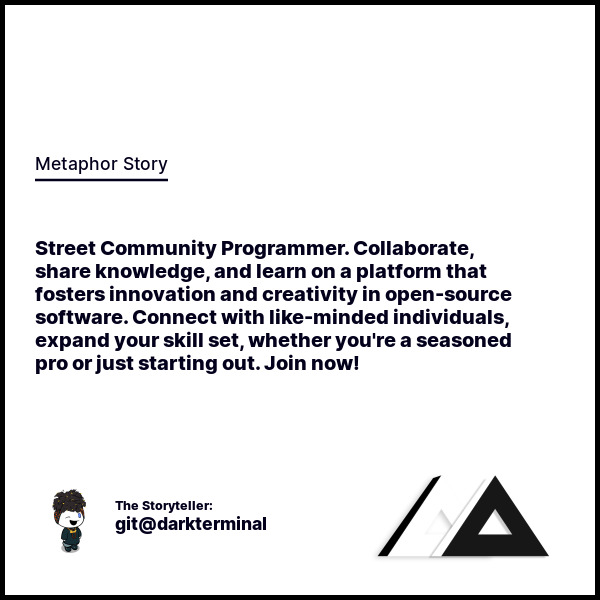
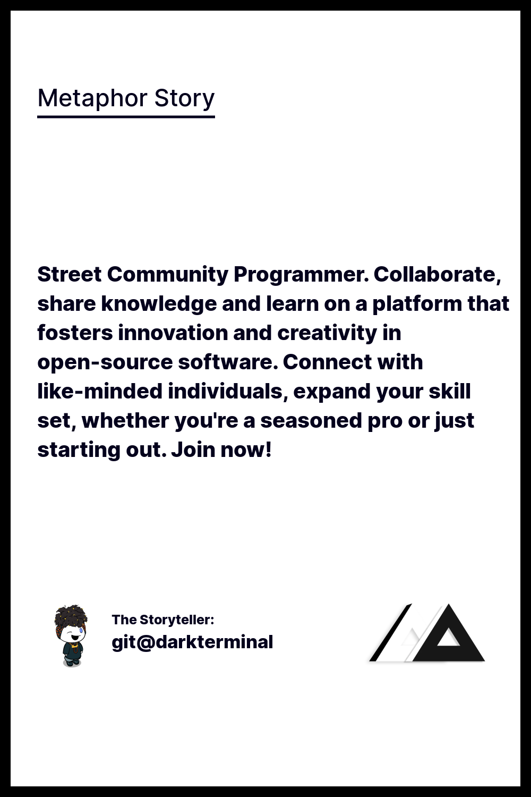

<h1 align="center">OG:IMAGE REST Generator</h1>

<p align="center">
  <strong>OG:IMAGE REST Generator</strong> is a free and powerful tool that simplifies the process of generating Open Graph images for your website or application. With our RESTful API, you can quickly and easily create customized images that will make your content stand out on social media platforms like Facebook, Twitter, Instagram, Pinterest and LinkedIn.
</p>

<p align="center">
  <a href="https://og-image-rest-generator.fly.dev/seo-banner?title=OG:IMAGE%20REST%20Generator%20-%20Free%20And%20Open%20Source!&author=darkterminal&head=Young%20Tyrex%20Release&writer=Punk%20Storyteller" target="_blank"><strong>Try This!</strong></a>
</p>

## Endpoint URL
```bash
https://og-image-rest-generator.fly.dev
```

## Usage
```http
GET /seo-banner
```

| Query     | Type     | Description                       |
| :-------- | :------- | :-------------------------------- |
| `head` | `string` | the head title legend |
| `title` | `string` | the title of the article or site you want to appear in the image |
| `writer` | `string` | the author legend |
| `author` | `string` | the name of author |
| `logo` | `string` | the logo of your app / web |
| `template` | `string` | Choose one: `default`, `facebook`, `facebook-minimal`, `twitter`, `twitter-minimal`, `instagram`, `instagram-minimal`, `linkedin`, `linkedin-minimal`, `pinterest` |

## Sample Images

### Default template (1342x853)


### Facebook template (Recommended size: 1200 x 630 pixels)


### Facebook Minimal template (Minimum size: 600 x 315 pixels)


### Twitter template (Recommended size: 1200 x 675 pixels)


### Twitter Minimal template (Minimum size: 600 x 335 pixels)


### Linkedin template (Recommended size: 1200 x 675 pixels)


### Linkedin Minimal template (Minimum size: 600 x 400 pixels)


### Instagram template (Recommended size: 1080 x 1080 pixels)


### Instagram Minimal template (Minimum size: 600 x 600 pixels)


### Pinterest template (Recommended size: 1000 x 1500 pixels)


## Help Wanted
- [ ] Improve font scaling and title truncation
- [ ] Improve layouts
- [ ] Adding more fonts (Currently using `Inter Extrabold` and `Inter Medium`)

Welcoming everyone that have passion and skill to make this app powerfull and free.

## Contribute

OG:IMAGE REST Generator is an open-source project, and we welcome contributions from developers and enthusiasts of all levels of experience.

[CONTRIBUTING.md](CONTRIBUTING.md)

## Donation / Support
If you find OG:IMAGE REST Generator to be a helpful tool for your website or application, please consider supporting the project. Your donation or sponsorship can help ensure that the project continues to thrive and improve over time. You can sponsor the project directly through Github Sponsor or donate through Paypal. Your support is greatly appreciated and will help to ensure that this powerful tool remains available for free to users all over the world. Thank you for your generosity and support!
